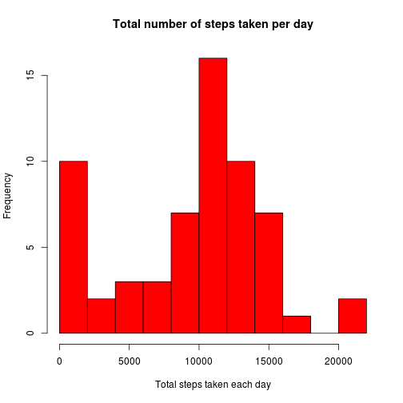
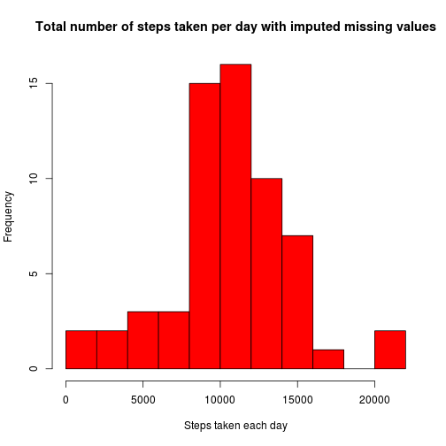

# Reproducible Research: Peer Assessment 1

## Loading and preprocessing the data

Turn off scientific notation:

```r
options(scipen = 999)
```


Check that a temporary directory exists so that the data can be unzipped there:

```r
# Checking the data directory exists
destDir = "./data"
if (!file.exists(destDir)) {
    dir.create(destDir)
}
```


Check the data file has been unzipped to the temporary directory:

```r
zipFile = "activity.zip"
destFile = "data/activity.csv"
if (!file.exists(destFile)) {
    print("Unzipping the file")
    unzip(zipFile, exdir = destDir)
}
```


Load the data file:

```r
data <- read.csv(destFile)
```


## What is mean total number of steps taken per day?

Make a histogram of the total number of steps taken each day:

```r
stepsByDate <- tapply(data$steps, data$date, sum, na.rm = TRUE)
hist(stepsByDate, breaks = 10, main = "Histogram of the total number of steps taken per day", 
    col = "red", xlab = "Total steps taken each day")
```

 


Calculate and report the **mean** and **median** total number of steps taken per day:

```r
meanSteps <- mean(stepsByDate)
medianSteps <- median(stepsByDate)
```

The mean total number of steps is **9354** and the median total number of steps is **10395**.

## What is the average daily activity pattern?

Make a time series plot of the 5-minute interval (x-axis) and the average number of steps taken, averaged across all days (y-axis):

```r
avgStepsPerInterval <- tapply(data$steps, data$interval, mean, na.rm = TRUE)
plot(as.integer(names(avgStepsPerInterval)), avgStepsPerInterval, type = "l", 
    xlab = "Time as 5-minute intervals", ylab = "Average steps per 5 minute interval", 
    main = "Time series of number of steps taken, averaged across all days")
```

 


Which 5-minute interval, on average across all the days in the dataset, contains the maximum number of steps?

```r
maxIntervalIndex = which.max(avgStepsPerInterval)
maxInterval = as.integer(names(maxIntervalIndex)[1])
maxSteps = avgStepsPerInterval[104]
hour = maxInterval%/%60
minutes = maxInterval%%60
result <- paste(hour, ":", minutes, sep = "")
```

The interval, **835**, corresponding to **13:55**, contained **206** corresponds to the maximum number of steps in an interval. 

## Inputing missing values

Note that there are a number of days/intervals where there are missing values (coded as NA). The presence of missing days may introduce bias into some calculations or summaries of the data.

Calculate and report the total number of missing values in the dataset (i.e. the total number of rows with NAs):

```r
missingrows <- sum(as.numeric(!complete.cases(data)))
```

The total number of missing rows is **2304**.

The strategy used for filling in missing values is as follows: 

If it is possible to calculate an average value for the number of steps per interval for that specific day, then that is used. However there are days that are missing all data. For these days, the average value for the number of steps per interval over all the days is used instead. 

```r
avgStepsPerDay <- tapply(data$steps, data$date, mean, na.rm = TRUE)
avgSteps <- mean(replace(avgStepsPerDay, is.na(avgStepsPerDay), 0))
avgStepsPerDay <- replace(avgStepsPerDay, is.na(avgStepsPerDay), avgSteps)
```


Create a new dataset that is equal to the original dataset but with the missing data filled in.:

```r
impute <- data
for (i in 1:nrow(impute)) {
    if (is.na(impute$steps[i])) {
        impute$steps[i] <- avgStepsPerDay[impute$date[i]]
    }
}
```


Make a histogram of the total number of steps taken each day:

```r
stepsByDateI <- tapply(impute$steps, impute$date, sum, na.rm = TRUE)
hist(stepsByDateI, breaks = 10, col = "red", xlab = "Steps taken each day", 
    main = "Histogram of the total number of steps taken per day with imputed missing values")
```

 

As you can see, the histogram is different because before there were several days with frequency 0. They have now been removed. 

Calculate and report the mean and median total number of steps taken per day:

```r
meanStepsI <- mean(stepsByDateI)
medianStepsI <- median(stepsByDateI)
```

The median number of steps is **10395** unchanged from **10395** whereas the mean number of steps is **10581** has changed from **9354**.

## Are there differences in activity patterns between weekdays and weekends?

Create a new factor variable in the dataset with two levels – “weekday” and “weekend” indicating whether a given date is a weekday or weekend day:

```r
impute$Date <- strptime(data$date, "%Y-%m-%d")
impute$wk <- ifelse((weekdays(as.Date(impute$date)) %in% c("Saturday", "Sunday")), 
    "weekend", "weekday")
avgsteps <- tapply(impute$steps, list(impute$interval, impute$wk), mean)
```


Make a panel plot containing a time series plot of the 5-minute interval (x-axis) and the average number of steps taken, averaged across all weekday days or weekend days (y-axis):

```r
library(lattice)
library(reshape)
avgs <- melt(avgsteps)
xyplot(avgs$value ~ avgs$X1 | avgs$X2, layout = c(1, 2), type = "l", xlab = "Interval", 
    ylab = "Number of steps")
```

 


Examining the two plots, it seems there is a difference in activity between the two days, as generally at the weekend activity continues through out the day, whereas in the week there is a peak of activity in the morning, then lower activity for the remainder of the day.
